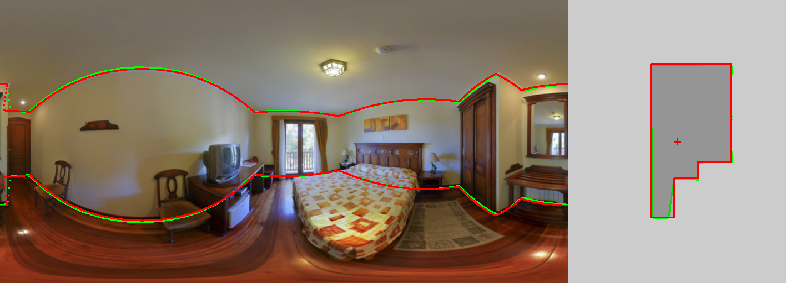
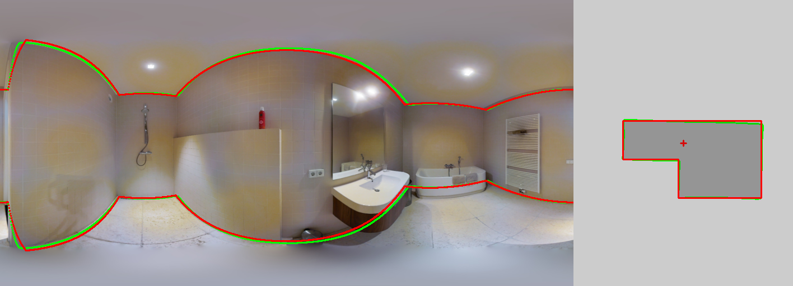

# LGT-Net
This is PyTorch implementation of our paper "[LGT-Net: Indoor Panoramic Room Layout Estimation with Geometry-Aware Transformer Network](https://arxiv.org/abs/2203.01824)"(CVPR'22). [[Supplemental Materials](https://drive.google.com/file/d/1vmNoWXdxKc4or2iUKNvkKRTV8pwxSi0J/view?usp=sharing)] [[Video](https://youtu.be/jh0pkaJaOr8)] [[Presentation](https://docs.google.com/presentation/d/1XC3SNCjuXT7m2jjT64UhUA145yBgHJaY/edit?usp=sharing&ouid=116719086346747292409&rtpof=true&sd=true)] [[Poster](https://drive.google.com/file/d/1Uy0qdkDVSARnz4ef9oNgI9tG_UgiuO00/view?usp=sharing)]


# Update
- 2023.5.18 Update post-processing. If you want to reproduce the post-processing results of paper, please switch to the old [commit](https://github.com/zhigangjiang/LGT-Net/tree/b642d6288e3a4bf265e54ab93eed3455e760402b). Check out the [Post-Porcessing.md](Post-Porcessing.md) for more information.


# Demo
- [demo notebook](demo.ipynb) for local Jupyter and Google Colab. To use it on Colab, upload `demo.ipynb` from your local copy with **File > Upload notebook**, then run the cells in order.

Run the Gradio app locally after installing the locked environment. The required mp3d and ZInd checkpoints are downloaded on first launch.

```shell
uv run python app.py
```


# Installation

The supported environment is Linux x86_64 with glibc 2.31 or newer and an NVIDIA driver compatible with CUDA 12.8. A system CUDA Toolkit is not required because PyTorch installs the CUDA runtime from its wheel.

Install the Python 3.12.12 environment and all dependencies from the lockfile with [uv](https://docs.astral.sh/uv/):

```shell
uv sync --frozen
```

uv automatically installs CPython 3.12.12 when it is not already available. PyQt5 and PyOpenGL are included in the default environment; the desktop 3D viewer additionally requires a graphical desktop session and the corresponding system OpenGL/X11 libraries.

# Preparing Dataset
### MatterportLayout
Download the [MatterportLayout archive](https://drive.google.com/file/d/1rEWXy5zHVozHC0hKHsuHTxchrNHfYoJ4/view?usp=sharing) from Google Drive and extract it into `src/dataset/`. The archive preserves the top-level `mp3d/` directory. The [demo notebook](demo.ipynb) downloads and extracts it automatically.

>If you have problems using this dataset, attention to this [issue](https://github.com/zhigangjiang/LGT-Net/issues/6).

Make sure the dataset files are stored as follows:
```
src/dataset/mp3d
|-- image
|   |-- 17DRP5sb8fy_08115b08da534f1aafff2fa81fc73512.png
|-- label
|   |-- 17DRP5sb8fy_08115b08da534f1aafff2fa81fc73512.json
|-- split
    |-- test.txt
    |-- train.txt
    |-- val.txt

```

---

**Statistics**

|  Split| All |4 Corners |6 Corners |8 Corners |>=10 Corners |
|--|--|--|--|--|--|
| All | 2295  | 1210 | 502 | 309 | 274|
|Train   |1647  | 841 | 371 | 225 | 210 |
|Val   |190   | 108 | 46 | 21 | 15 |
|Test    |458   | 261 | 85 | 63 | 49 |

---

### ZInd
Office ZInd dataset is at [here](https://github.com/zillow/zind).

Make sure the dataset files are stored as follows:
```
src/dataset/zind
|-- 0000
|   |-- panos
|   |   |-- floor_01_partial_room_01_pano_14.jpg
|   |-- zind_data.json
|-- room_shape_simplicity_labels.json
|-- zind_partition.json
```

**Statistics**

|  Split| All |4 Corners |5 Corners |6 Corners |7 Corners |8 Corners|9 Corners |>=10 Corners |Manhattan |No-Manhattan(%) |
|--|--|--|--|--|--|--|--|--|--|--|
|All| 31132 | 17293 |1803 | 7307 | 774 | 2291 | 238 | 1426 |26664 | 4468(14.35%)|
|Train   | 24882 | 13866 |1507 | 5745 | 641 | 1791 | 196 | 1136 |21228 | 3654(14.69%)|
|Val    |  3080 | 1702 | 153  |  745 | 81  |  239 | 22  | 138  |2647 | 433(14.06%)|
|Test    |  3170 | 1725 | 143  |  817 | 52  |  261 | 20  | 152  |2789  | 381(12.02%)|

---

### PanoContext and Stanford 2D-3D
We follow the same preprocessed pano/s2d3d proposed by [HorizonNet](https://github.com/sunset1995/HorizonNet#dataset).
Download the [combined archive](https://drive.google.com/file/d/164DnSxz6ap8GcytRAPfJlIMvNPaikZEc/view?usp=sharing) from Google Drive and extract it into `src/dataset/`. The archive preserves the top-level `pano_s2d3d/` directory. The [demo notebook](demo.ipynb) downloads and extracts it automatically.

Make sure the dataset files are stored as follows:

```
src/dataset/pano_s2d3d
|-- test
|   |-- img
|   |   |-- camera_0000896878bd47b2a624ad180aac062e_conferenceRoom_3_frame_equirectangular_domain_.png
|   |-- label_cor
|       |-- camera_0000896878bd47b2a624ad180aac062e_conferenceRoom_3_frame_equirectangular_domain_.txt
|-- train
|   |-- img
|   |-- label_cor
|-- valid
    |-- img
    |-- label_cor

```
# Downloading Pre-trained Weights
Pre-trained weights are distributed as two archives in the [data release](https://github.com/PINTO0309/LGT-Net/releases/tag/data):

- [lgt-net-checkpoints-benchmarks.zip](https://github.com/PINTO0309/LGT-Net/releases/download/data/lgt-net-checkpoints-benchmarks.zip)
  - `mp3d/best.pkl`: trained on MatterportLayout
  - `zind/best.pkl`: trained on ZInD
  - `pano/best.pkl`: trained on PanoContext (train) and Stanford 2D-3D (whole)
  - `s2d3d/best.pkl`: trained on Stanford 2D-3D (train) and PanoContext (whole)
- [lgt-net-checkpoints-ablation-study.zip](https://github.com/PINTO0309/LGT-Net/releases/download/data/lgt-net-checkpoints-ablation-study.zip)
  - `ablation_study_full/best.pkl`: full LGT-Net ablation configuration trained on MatterportLayout

Both archives preserve the complete `checkpoints/SWG_Transformer_LGT_Net/` hierarchy. Extract them into the repository root; no manual file moves or directory renaming are required. The [demo notebook](demo.ipynb) downloads and extracts both archives automatically.

After extraction, the files are arranged as follows:

```
checkpoints
|-- SWG_Transformer_LGT_Net
|   |-- ablation_study_full
|   |   |-- best.pkl
|   |-- mp3d
|   |   |-- best.pkl
|   |-- pano
|   |   |-- best.pkl
|   |-- s2d3d
|   |   |-- best.pkl
|   |-- zind
|       |-- best.pkl
```

# ONNX Export

Export all five published checkpoints with the default opset 17:

```shell
uv run python export_onnx.py
```

The script exports each checkpoint, automatically simplifies it with `onnxsim`, checks the simplified graph with ONNX, and compares its outputs with PyTorch using ONNX Runtime. Simplified models are written to `checkpoints/onnx/`:

```text
checkpoints/onnx
|-- lgt_net_ablation_study_full_opset17.onnx
|-- lgt_net_mp3d_opset17.onnx
|-- lgt_net_pano_opset17.onnx
|-- lgt_net_s2d3d_opset17.onnx
|-- lgt_net_zind_opset17.onnx
```

Select a different opset with `--opset`, or export only selected checkpoints with `--models`:

```shell
uv run python export_onnx.py --opset 18 --models mp3d zind
```

Models use a fixed batch size of 1 by default. Add `--dynamic-batch` only when the target runtime needs a dynamic batch dimension:

```shell
uv run python export_onnx.py --dynamic-batch
```

Export runs on CPU by default. Use `--device cuda:0` to perform the PyTorch export pass on a CUDA device. The ONNX interface is:

- Input: `image`, float32 `[1, 3, 512, 1024]`, with image values in the `[0, 1]` range
- Output: `depth`, float32 `[1, 256]`
- Output: `ratio`, float32 `[1, 1]`

With `--dynamic-batch`, the leading `1` in all three shapes becomes a dynamic `batch` dimension. The channel and spatial dimensions remain fixed by the model architecture.

## ONNX Runtime inference

`inference_onnx.py` runs an exported LGT-Net model without loading the PyTorch checkpoint. It accepts a panorama image or a glob pattern and generates the same layout JSON and a comparable visualization as `inference.py`.

Before running inference, install the locked environment and make sure the required ONNX model exists. For example, export only the MatterportLayout model with:

```shell
uv sync --frozen
uv run python export_onnx.py --models mp3d
```

### CUDA quick start

Run both included panoramas with CUDA device 0:

```shell
uv run python inference_onnx.py \
  --model checkpoints/onnx/lgt_net_mp3d_opset17.onnx \
  --img-glob 'src/demo/demo*.png' \
  --output-dir src/output_onnx \
  --post-processing manhattan \
  --backend cuda \
  --device-id 0
```

The command prints the enabled providers at startup. For this command, the first provider must be `CUDAExecutionProvider`; the script reports an error instead of silently running only on CPU when CUDA cannot be enabled.

The following samples were generated from the included panoramas with the CUDA settings above. Green lines show the raw network prediction, red lines show the Manhattan post-processed layout, and the right-hand panel is the estimated floorplan.

`src/demo/demo1.png`:



`src/demo/demo.png`:



### Selecting a backend

Use `--backend` to select the ONNX Runtime execution backend:

| Backend | Option | Provider priority | Notes |
|---|---|---|---|
| CPU | `--backend cpu` | CPU | Default; no NVIDIA GPU is required. |
| CUDA | `--backend cuda` | CUDA, then CPU | Select a GPU with `--device-id`. CUDA and cuDNN libraries from the locked PyTorch environment are preloaded automatically. |
| TensorRT | `--backend tensorrt` | TensorRT, CUDA, then CPU | Requires compatible TensorRT runtime libraries. Engine caching and FP16 are enabled by default. |

For CPU inference, change only the backend:

```shell
uv run python inference_onnx.py \
--model checkpoints/onnx/lgt_net_mp3d_opset17.onnx \
--img-glob src/demo/demo1.png \
--output-dir src/output_onnx \
--backend cpu
```

For TensorRT, optionally select a persistent engine-cache directory. The first run can take considerably longer while TensorRT builds the engine; subsequent sessions reuse the cache.

```shell
uv run python inference_onnx.py \
--model checkpoints/onnx/lgt_net_mp3d_opset17.onnx \
--img-glob src/demo/demo1.png \
--output-dir src/output_onnx \
--backend tensorrt \
--device-id 0 \
--trt-engine-cache-dir checkpoints/onnx/.trt_cache/mp3d
```

Pass `--no-trt-fp16` if FP16 should be disabled. When `--trt-engine-cache-dir` is omitted, the default is `checkpoints/onnx/.trt_cache/<model name>/`.

### Inputs, models, and outputs

- `--model` selects one of the exported `.onnx` files under `checkpoints/onnx/`. The MatterportLayout model is used by default.
- `--img-glob` accepts one image or a glob such as `'path/to/panoramas/*.png'`. Quote wildcard patterns so that the script, rather than the shell, expands them.
- `--post-processing` accepts `manhattan` (default), `atalanta`, or `original`.
- `--output-dir` selects the destination directory and defaults to `src/output_onnx`.
- `--device-id` selects the CUDA device for the CUDA and TensorRT backends and defaults to `0`.

Each input image produces:

- `<name>_pred.png`: boundary and floorplan visualization
- `<name>_pred.json`: PanoAnnotator-compatible layout data
- `<name>_vp.txt`: vanishing points, when Manhattan alignment is selected

Both fixed-batch-1 and dynamic-batch exports are accepted. Multiple matched panoramas are processed one at a time. Run `uv run python inference_onnx.py --help` to see every option.

# Evaluation
You can evaluate by executing the following command:

- MatterportLayout dataset
    ```shell
    uv run python main.py --cfg src/config/mp3d.yaml --mode test --need_rmse
    ```
- ZInd dataset
    ```shell
    uv run python main.py --cfg src/config/zind.yaml --mode test --need_rmse
    ```
- PanoContext dataset
  ```shell
  uv run python main.py --cfg src/config/pano.yaml --mode test --need_cpe --post_processing manhattan --force_cube
  ```
- Stanford 2D-3D dataset
    ```shell
    uv run python main.py --cfg src/config/s2d3d.yaml --mode test --need_cpe --post_processing manhattan --force_cube
    ```
    - `--post_processing` type of post-processing approach,
      we use [DuLa-Net](https://github.com/SunDaDenny/DuLa-Net) post-processing and optimize by adding occlusion detection (described in [here](Post-Porcessing.md) ) to process `manhattan` constraint (`manhattan_old` represents the original method),
      use [DP algorithm](https://en.wikipedia.org/wiki/Ramer%E2%80%93Douglas%E2%80%93Peucker_algorithm)  to process `atalanta` constraint, default is disabled.
    - `--need_rmse` need to evaluate root mean squared error and delta error, default is disabled.
    - `--need_cpe` need to evaluate corner error and pixel error, default is disabled.
    - `--need_f1` need to evaluate corner metrics (Precision, Recall and F$_1$-score)
      with **10 pixels** as threshold(code from [here](https://github.com/bertjiazheng/indoor-layout-evaluation)), default is disabled.
    - `--force_cube` force cube shape when evaluating, default is disabled.
    - `--wall_num` different corner number to evaluate, default is all.
    - `--save_eval` save the visualization evaluating results of each panorama,
      the output results locate in the corresponding checkpoint directory
      (e.g., `checkpoints/SWG_Transformer_LGT_Net/mp3d/results/test`), default is disabled.

# Training
Execute the following commands to train  (e.g., MatterportLayout dataset):
```shell
uv run python main.py --cfg src/config/mp3d.yaml --mode train
```
You can copy and modify the configuration in `YAML` file for other training.

# Inference
We provide an inference script (`inference.py`) that you can
try to predict your panoramas by executing the following command (e.g., using pre-trained weights of MatterportLayout dataset):
```shell
uv run python inference.py --cfg src/config/mp3d.yaml --img_glob src/demo/demo1.png --output_dir src/output --post_processing manhattan
```
It will output json files(`xxx_pred.json`, format is the same as [PanoAnnotator](https://github.com/SunDaDenny/PanoAnnotator)) and visualization images (`xxx_pred.png`) under **output_dir**.
visualization image:


- `--img_glob` a panorama path or directory path for prediction.

- `--post_processing` If `manhattan` is selected,
we will preprocess the panorama so that the vanishing points are
aligned with the axes for post-processing. Note that after preprocessing
our predicted results will not align with your input panoramas,
you can use the output file (`vp.txt`) of vanishing points to reverse align them manually.

- `--visualize_3d` 3D visualization of output results (need install dependencies and GUI desktop environment).
- `--output_3d`  output the object file of 3D mesh reconstruction.
# Acknowledgements
The code style is modified based on [Swin-Transformer](https://github.com/microsoft/Swin-Transformer).

Some components refer to the following projects:

- [HorizonNet](https://github.com/sunset1995/HorizonNet#1-pre-processing-align-camera-rotation-pose)
- [LED2-Net](https://github.com/fuenwang/LED2-Net)
- [PanoPlane360](https://github.com/sunset1995/PanoPlane360)
- [DuLa-Net ](https://github.com/SunDaDenny/DuLa-Net)
- [indoor-layout-evaluation](https://github.com/bertjiazheng/indoor-layout-evaluation)

# Citation
If you use this code for your research, please cite
```
@InProceedings{jiang2022lgt,
    author    = {Jiang, Zhigang and Xiang, Zhongzheng and Xu, Jinhua and Zhao, Ming},
    title     = {LGT-Net: Indoor Panoramic Room Layout Estimation with Geometry-Aware Transformer Network},
    booktitle = {Proceedings of the IEEE Conference on Computer Vision and Pattern Recognition (CVPR)},
    year      = {2022}
}
```
